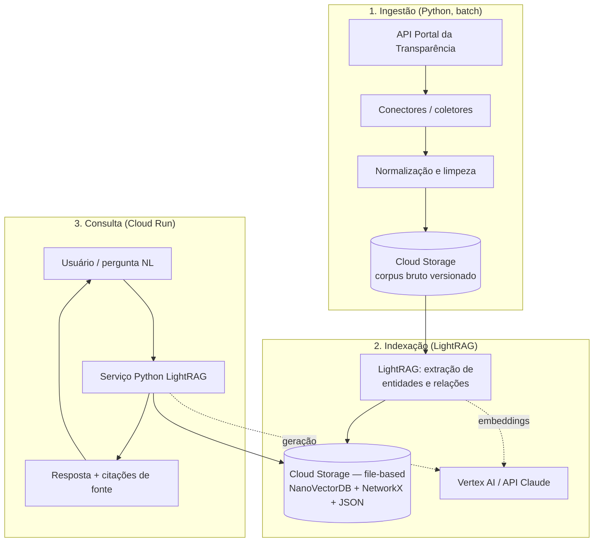

# 03 — Arquitetura

> Stack: **Python + LightRAG + GCP**, com foco em **baixo custo** (ver
> [Constituição P6](00-constitution.md)). Esta é a arquitetura-alvo; **nada foi
> implementado ainda**.

## Visão geral dos componentes

## Fluxo de ingestão

1. Conectores em Python chamam os endpoints da API do Portal da Transparência
   (paginação, rate limit, chave de API — ver [04-data-sources.md](04-data-sources.md)).
2. Os registros são normalizados (campos padronizados, tipos, identificadores como
   CNPJ e código de órgão) e convertidos em documentos textuais que descrevem cada
   entidade/transação.
3. O corpus bruto e normalizado é gravado no **Cloud Storage**, com versionamento
   (prefixo por data de coleta) para reprodutibilidade ([Constituição P5](00-constitution.md)).

## Fluxo de indexação

1. O **LightRAG** processa os documentos, extrai **entidades** (órgão, fornecedor,
   contrato, licitação, empenho…) e **relações** entre elas, e gera descrições
   curtas por entidade.
2. Embeddings são gerados via **Vertex AI** (ou API Claude) — custo por chamada.
3. Grafo de conhecimento **e** índice vetorial são persistidos pelos **backends
   file-based nativos do LightRAG** — NanoVectorDB (vetores), NetworkX (grafo) e
   JSON (KV/doc-status) — gravados no **Cloud Storage**. Sem servidor de banco.

## Fluxo de consulta

1. O serviço Python (em **Cloud Run**, escala a zero) recebe a pergunta.
2. O LightRAG executa o **retrieval dual-level**: nível *local* (entidades
   específicas) e *global* (temas/relações amplas).
3. O contexto recuperado + a pergunta são enviados ao LLM (**Vertex AI / API
   Claude**) para gerar a resposta.
4. A resposta retorna **acompanhada das fontes** citadas ([Constituição P1](00-constitution.md)).

## Mapeamento componente lógico → serviço GCP

| Componente lógico | Serviço GCP | Motivo |
| --- | --- | --- |
| Corpus bruto/versionado | Cloud Storage | Custo baixo por GB; versionamento simples |
| Grafo + vetores (backend LightRAG) | Cloud Storage (arquivos file-based) | Sem servidor de banco; custo de banco zero |
| Serviço de consulta | Cloud Run | Escala a zero; paga só no uso |
| Embeddings / LLM | Vertex AI ou API Claude | Pay-per-use, sem infra fixa |
| Orquestração de ingestão (batch) | Cloud Run Jobs / Cloud Scheduler | Execução periódica sob demanda |
| Segredos (chaves) | Secret Manager | Gestão segura de credenciais |

## Decisões de Arquitetura (ADRs)

### ADR-001 — Armazenamento file-based no Cloud Storage (sem banco gerenciado)
**Contexto**: existem opções gerenciadas (Cloud SQL, Vertex AI Vector Search,
Spanner Graph) que reduzem esforço de operação, mas têm custo fixo/alto. O LightRAG
separa o armazenamento em 4 tipos plugáveis (KV, Vetorial, Grafo, Doc-Status) e seu
**padrão é totalmente file-based**.
**Decisão**: usar os **backends file-based nativos do LightRAG** — **NanoVectorDB**
(vetores), **NetworkX** (grafo) e **JSON** (KV/doc-status) — persistidos no **Cloud
Storage** (montado no Cloud Run via gcsfuse ou sincronizado no startup). **Nenhum
servidor de banco de dados.**
**Consequências**: custo de banco **zero** (paga só armazenamento por GB) e máxima
**portabilidade** (roda igual localmente). Em troca, há **escritor único** (sem
indexação concorrente) e a reindexação carrega estruturas em memória — aceitável
para PoC e corpus pequeno/médio com carga read-heavy. ✔️ Alinhado a
[Constituição P6](00-constitution.md).
**Caminho de upgrade**: se a concorrência de escrita ou o volume exigirem, migrar
para **Postgres + pgvector + AGE** numa **VM e2-micro (free tier)** — backends
nativos do LightRAG — mantendo custo baixo e portabilidade, sem recorrer a Cloud
SQL/Spanner gerenciados.

### ADR-002 — LightRAG como motor de RAG
**Contexto**: gastos públicos formam uma rede de entidades interligadas; busca
vetorial pura perde essas relações.
**Decisão**: usar **LightRAG** (knowledge graph + retrieval dual-level), que reduz
custo de indexação e latência mantendo qualidade.
**Consequências**: melhor captura de relações fornecedor↔órgão↔contrato; depende de
qualidade da extração de entidades (mitigado em [05-knowledge-graph.md](05-knowledge-graph.md)).

### ADR-003 — Cloud Run para o serviço de consulta
**Decisão**: empacotar o serviço Python em contêiner no **Cloud Run** (escala a
zero).
**Consequências**: sem custo quando ocioso; cold start aceitável para uso
conversacional. Revisar caso latência (RNF3) seja insuficiente.

### ADR-004 — Provedor de LLM/embeddings flexível
**Decisão**: abstrair o provedor de LLM/embeddings para alternar entre **Vertex
AI** e **API Claude** conforme custo/qualidade.
**Consequências**: evita lock-in; exige uma camada de abstração fina no código.

## Riscos arquiteturais

- **Qualidade da extração de entidades** (nomes de fornecedores inconsistentes,
  CNPJs ausentes) → tratar na normalização (RF1) e na ontologia (05).
- **Escritor único / volume** do armazenamento file-based → particionar o corpus
  por ano/órgão, usar ingestão incremental (RNF2) e acionar o caminho de upgrade do
  ADR-001 (Postgres em VM free-tier) quando necessário.
- **Custo de embeddings** em reindexações totais → indexação incremental e cache.
