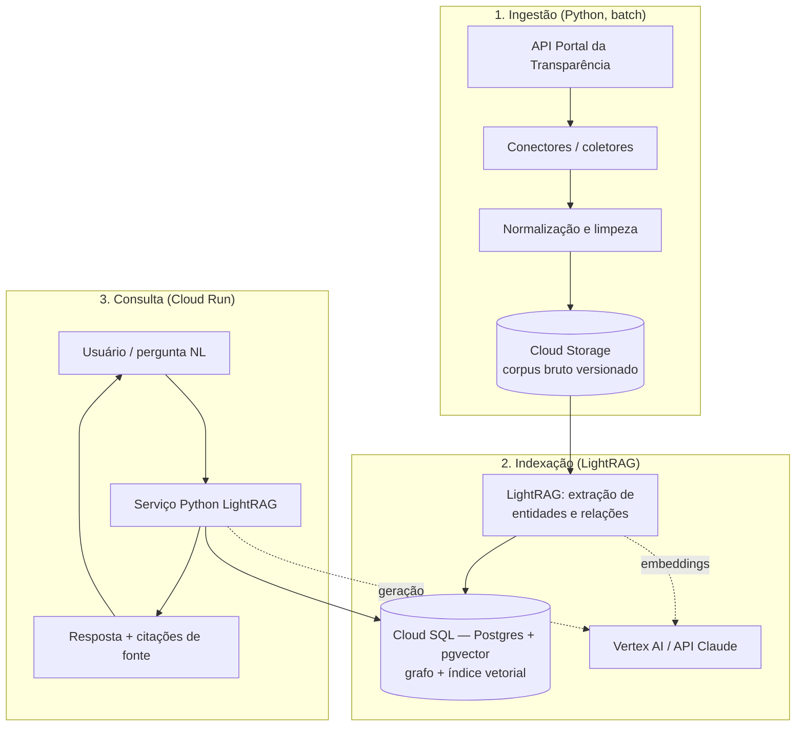

# 03 — Arquitetura

> Stack: **Python + LightRAG + GCP**, com foco em **baixo custo** (ver
> [Constituição P6](00-constitution.md)). Esta é a arquitetura-alvo; **nada foi
> implementado ainda**.

## Visão geral dos componentes

## Fluxo de ingestão

1. Conectores em Python chamam os endpoints da API do Portal da Transparência
   (paginação, rate limit, chave de API — ver [04-data-sources.md](04-data-sources.md)).
2. Os registros são normalizados (campos padronizados, tipos, identificadores como
   CNPJ e código de órgão) e convertidos em documentos textuais que descrevem cada
   entidade/transação.
3. O corpus bruto e normalizado é gravado no **Cloud Storage**, com versionamento
   (prefixo por data de coleta) para reprodutibilidade ([Constituição P5](00-constitution.md)).

## Fluxo de indexação

1. O **LightRAG** processa os documentos, extrai **entidades** (órgão, fornecedor,
   contrato, licitação, empenho…) e **relações** entre elas, e gera descrições
   curtas por entidade.
2. Embeddings são gerados via **Vertex AI** (ou API Claude) — custo por chamada.
3. Grafo de conhecimento **e** índice vetorial são persistidos no **Cloud SQL
   (PostgreSQL + `pgvector`)**, que serve como backend único do LightRAG.

## Fluxo de consulta

1. O serviço Python (em **Cloud Run**, escala a zero) recebe a pergunta.
2. O LightRAG executa o **retrieval dual-level**: nível *local* (entidades
   específicas) e *global* (temas/relações amplas).
3. O contexto recuperado + a pergunta são enviados ao LLM (**Vertex AI / API
   Claude**) para gerar a resposta.
4. A resposta retorna **acompanhada das fontes** citadas ([Constituição P1](00-constitution.md)).

## Mapeamento componente lógico → serviço GCP

| Componente lógico | Serviço GCP | Motivo |
| --- | --- | --- |
| Corpus bruto/versionado | Cloud Storage | Custo baixo por GB; versionamento simples |
| Grafo + vetores (backend LightRAG) | Cloud SQL (Postgres + pgvector) | Backend único, barato e portável |
| Serviço de consulta | Cloud Run | Escala a zero; paga só no uso |
| Embeddings / LLM | Vertex AI ou API Claude | Pay-per-use, sem infra fixa |
| Orquestração de ingestão (batch) | Cloud Run Jobs / Cloud Scheduler | Execução periódica sob demanda |
| Segredos (chaves) | Secret Manager | Gestão segura de credenciais |

## Decisões de Arquitetura (ADRs)

### ADR-001 — Evitar serviços gerenciados caros
**Contexto**: existem opções gerenciadas (Vertex AI Vector Search, Spanner Graph)
que reduzem esforço de operação, mas têm custo fixo/alto.
**Decisão**: usar **LightRAG self-hosted** com **PostgreSQL + pgvector** (Cloud
SQL) como backend único para vetores e grafo.
**Consequências**: custo significativamente menor e **portabilidade** (Postgres
roda em qualquer lugar). Em troca, assumimos a operação do backend. ✔️ Alinhado a
[Constituição P6](00-constitution.md).

### ADR-002 — LightRAG como motor de RAG
**Contexto**: gastos públicos formam uma rede de entidades interligadas; busca
vetorial pura perde essas relações.
**Decisão**: usar **LightRAG** (knowledge graph + retrieval dual-level), que reduz
custo de indexação e latência mantendo qualidade.
**Consequências**: melhor captura de relações fornecedor↔órgão↔contrato; depende de
qualidade da extração de entidades (mitigado em [05-knowledge-graph.md](05-knowledge-graph.md)).

### ADR-003 — Cloud Run para o serviço de consulta
**Decisão**: empacotar o serviço Python em contêiner no **Cloud Run** (escala a
zero).
**Consequências**: sem custo quando ocioso; cold start aceitável para uso
conversacional. Revisar caso latência (RNF3) seja insuficiente.

### ADR-004 — Provedor de LLM/embeddings flexível
**Decisão**: abstrair o provedor de LLM/embeddings para alternar entre **Vertex
AI** e **API Claude** conforme custo/qualidade.
**Consequências**: evita lock-in; exige uma camada de abstração fina no código.

## Riscos arquiteturais

- **Qualidade da extração de entidades** (nomes de fornecedores inconsistentes,
  CNPJs ausentes) → tratar na normalização (RF1) e na ontologia (05).
- **Volume de dados** pode crescer o custo do Postgres → particionar por
  ano/órgão e considerar ingestão incremental (RNF2).
- **Custo de embeddings** em reindexações totais → indexação incremental e cache.
