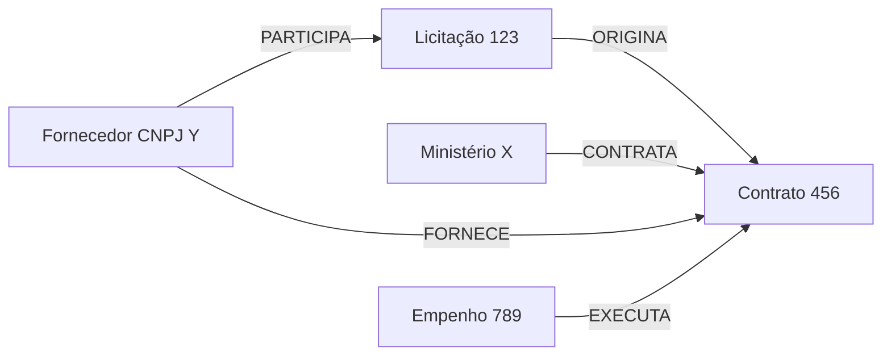

# 05 — Knowledge Graph

> O diferencial da Lupa Pública é capturar as **relações** entre as entidades de
> gasto, não apenas indexar texto. Este documento define a **ontologia do domínio**
> que o LightRAG deve popular.

## Por que um grafo

Gastos públicos formam uma rede: um **órgão** firma um **contrato** com um
**fornecedor**, originado de uma **licitação**, executado por **empenhos**. Busca
vetorial pura responde "o que se parece com a pergunta", mas perde "o que está
**conectado**". O knowledge graph do LightRAG permite percorrer essas cadeias
(ex.: todos os contratos de um fornecedor, em todos os órgãos).

## Entidades (nós)

| Entidade | Identificador | Atributos principais |
| --- | --- | --- |
| **Órgão** | `orgao_codigo` | nome, esfera, unidade gestora |
| **Fornecedor** | `cnpj` (ou CPF público) | razão social, porte |
| **Contrato** | `documento_id` | objeto, valor, vigência |
| **Licitação** | `documento_id` | modalidade, objeto, valor estimado, resultado |
| **Empenho** | `documento_id` | valor empenhado/liquidado/pago, ação orçamentária |
| **Convênio** | `documento_id` | objeto, valor, convenente |
| **Emenda parlamentar** | `documento_id` | autor, valor, destino |
| **Servidor** | id público | cargo (uso restrito — ver [P2](00-constitution.md)) |

## Relações (arestas)

| Relação | De → Para | Significado |
| --- | --- | --- |
| `CONTRATA` | Órgão → Contrato | órgão firmou o contrato |
| `FORNECE` | Fornecedor → Contrato | fornecedor é parte do contrato |
| `ORIGINA` | Licitação → Contrato | contrato originou-se da licitação |
| `EXECUTA` | Empenho → Contrato | empenho executa o contrato |
| `TRANSFERE` | Órgão → Convênio | órgão repassa via convênio |
| `DESTINA` | Emenda → Órgão/Convênio | emenda direciona recurso |
| `PARTICIPA` | Fornecedor → Licitação | fornecedor participou do certame |

## Exemplo (mermaid)

## Extração e enriquecimento

- **Automático (LightRAG)**: a partir dos documentos normalizados, o LightRAG
  extrai entidades/relações e gera descrições por entidade.
- **Determinístico (recomendado)**: como os dados de origem já são estruturados
  (CNPJ, código de órgão, IDs de documento), parte das arestas pode ser criada de
  forma **determinística** na ingestão, melhorando a precisão e reduzindo
  dependência da extração por LLM.
- **Normalização de entidades**: unificar fornecedores por **CNPJ** (não por
  nome, que varia); tratar CNPJs ausentes como entidade incompleta sinalizada.

## Consultas que se beneficiam do grafo

- "Todos os contratos do fornecedor **Y**, em **qualquer** órgão."
- "Fornecedores que participaram da licitação **L** e também têm contratos diretos
  com o órgão **O**."
- "Cadeia completa de um contrato: licitação → contrato → empenhos."

## Relação com pontos de atenção (RF6)

Padrões no grafo podem sugerir **pontos de atenção** (ex.: fornecedor único
recorrente em dispensas de licitação de um mesmo órgão). Conforme
[Constituição P4](00-constitution.md), estes são apresentados como **hipóteses a
investigar**, nunca como afirmação de irregularidade.
