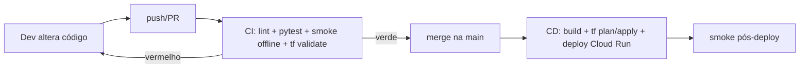

# 08 — Infraestrutura e CI/CD

> Cobre o provisionamento da infra com **Terraform** ([ADR-005](03-architecture.md))
> e a automação de **CI/CD com GitHub Actions** ([ADR-006](03-architecture.md)),
> respeitando o gate de **teste local antes de deploy** ([Constituição P9](00-constitution.md)).

## Infraestrutura como Código (Terraform)

Toda a infra GCP é descrita em `infra/terraform/`. Nada é criado manualmente no
console ([P8](00-constitution.md)).

### Recursos provisionados

| Recurso GCP | Para quê |
| --- | --- |
| `google_storage_bucket` (corpus + LightRAG file-based) | Armazenamento do corpus e dos índices file-based ([ADR-001](03-architecture.md)) |
| `google_cloud_run_v2_service` | Serviço de consulta (escala a zero) |
| `google_cloud_run_v2_job` | Job de ingestão em batch |
| `google_cloud_scheduler_job` | Dispara a ingestão periodicamente |
| `google_secret_manager_secret` | Chave da API do Portal e chaves de LLM |
| `google_service_account` + IAM | Identidade mínima por componente |
| `google_artifact_registry_repository` | Imagens de contêiner do serviço/job |

### Convenções

- **State remoto** em bucket GCS (`backend "gcs"`), com versionamento.
- **Variáveis** por ambiente em `*.tfvars` (ex.: `dev.tfvars`, `prod.tfvars`);
  nunca commitar segredos — eles vão para o Secret Manager.
- **Princípio do menor privilégio**: uma service account por componente.
- `terraform plan` roda em **todo PR**; `terraform apply` só em merge na branch
  principal, via CI/CD.

### Layout

```
infra/terraform/
  main.tf          # providers, backend, locals
  variables.tf     # entradas (project_id, region, etc.)
  storage.tf       # bucket(s)
  run.tf           # Cloud Run service + job
  scheduler.tf     # Cloud Scheduler
  iam.tf           # service accounts + bindings
  secrets.tf       # Secret Manager (sem valores)
  outputs.tf       # URLs/identificadores
  environments/
    dev.tfvars
    prod.tfvars
```

## CI/CD (GitHub Actions)

Dois workflows em `.github/workflows/`:

### `ci.yml` — em todo push e pull request

1. **Lint** (`ruff`) e **format check**.
2. **Testes unitários** (`pytest`).
3. **Smoke test offline** (`scripts/local_smoke.sh`) — roda o pipeline completo
   com o **provedor fake** (sem rede, sem credenciais). É o gate de [P9](00-constitution.md).
4. **`terraform fmt -check` + `terraform validate`** (sem aplicar).

> O CI **não** acessa a GCP nem chama LLMs reais — é 100% reproduzível localmente
> via o mesmo `scripts/local_smoke.sh`.

### `cd.yml` — em merge na branch principal (e/ou tags)

1. Autentica na GCP via **Workload Identity Federation** (OIDC, sem chave de SA
   de longa duração).
2. **Build** da imagem e push para o Artifact Registry.
3. **`terraform plan`** → revisão → **`terraform apply`** (com aprovação de
   *environment* protegido).
4. **Deploy** da nova imagem no Cloud Run.
5. *Smoke test pós-deploy* (consulta de fumaça contra o serviço publicado).

### Autenticação

- **Sem chaves estáticas**: usa OIDC + Workload Identity Federation.
- Segredos de runtime (chave da API do Portal, chave de LLM) ficam no **Secret
  Manager** e são injetados no Cloud Run, não no GitHub.

## Fluxo ponta a ponta (P9 na prática)



O smoke test **local/offline** (passo C) é obrigatório e idêntico ao que o
desenvolvedor roda no sandbox antes de abrir o PR — garantindo que nada sobe para
a GCP sem validação local ([P9](00-constitution.md)).
